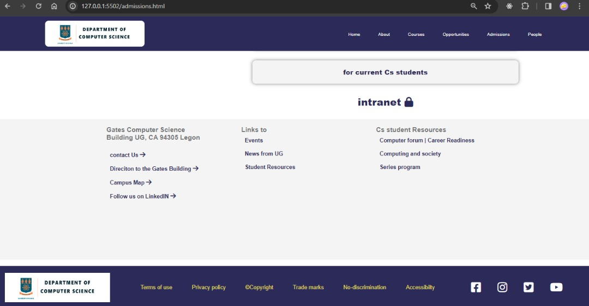

# 11294254_DCIT205

Welcome to the University of Ghana computer science  department webiste. This website enables easy surfing of the departmental factions as it contains various aspects and links taking you to expected info you would to know about the UG computer science department. The site is meant to display all the relevant information about the computer science department including the courses offered, admission reletaed information, the staff and the students and opportunities available to students. <strong>HAPPY TOUR !!</strong>

 
<h2>Cloning and setting up the project

 Cloning and setting up the projects can be achieved in a few steps as follow

On github, navigate to the repository and and copy the link to the repository(11294254_DCIT205). !! Located in the top of your browser

To clone the project unto your local machine, navigate a folder where you want to put you local repo , type in the command
GIT CLONE  to have a copy of the repo to your local machine

to see the output on your pc , open the files on VSCODE and then open with live server to see the output of the site

 
<h3>JOSIAH OKORNOE, 11294254</h3>

 

